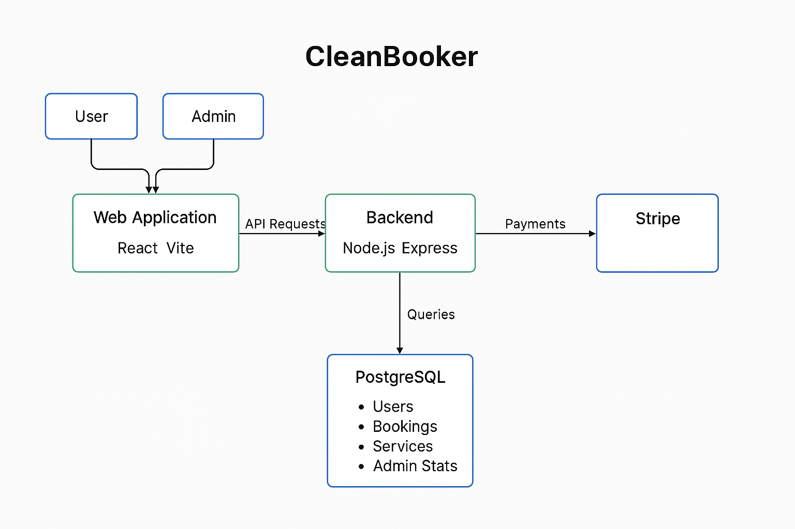

# Software Design

## API Documentation

## Architecture Diagram

Users and admins interact with a React + Vite-based web frontend, which communicates with a Node.js + Express backend via API requests. The backend handles business logic, processes payments through Stripe, and interacts with a PostgreSQL database to manage core entities like users, bookings, services, and admin statistics. This architecture ensures a modular, scalable, and maintainable system optimized for both end-user experience and administrative operations.

## Techonology Used

> Backend

- Node.js + Express + TS

* express: lightweight web framework
* cors: enables cross-origin requests from the frontend
* dotenv: manages environment variables
* pg: PostgreSQL client
* nodemon: auto-restarts server during development
* typescript: TypeScript compiler
* ts-node-dev: auto-reload during development
* @types/\*: type definitions
* zod: Zod schemas for request validation
* hamlet: Helmet for security headers

- Prisma ORM

* Auto generates types for your database models
* Easy to read schema
* Powerful querying without raw SQL
* Built in migrations
* Works perfectly with TypeScript
